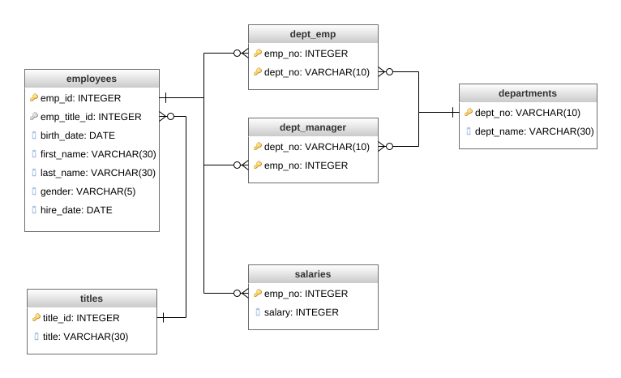
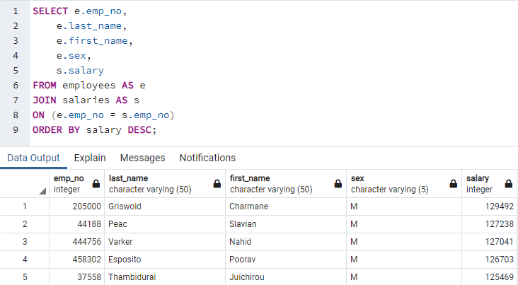
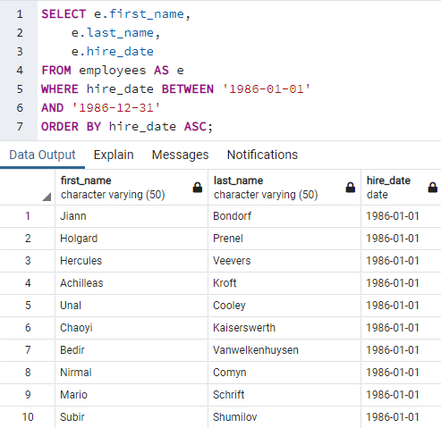
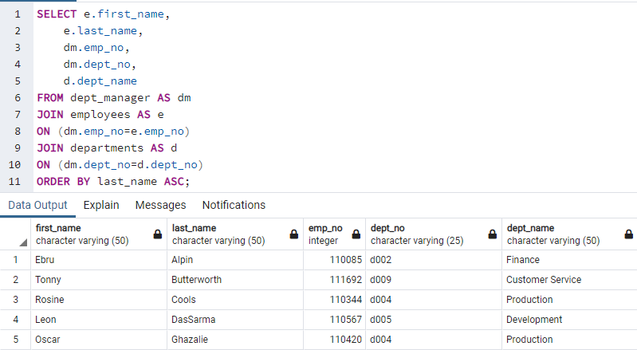
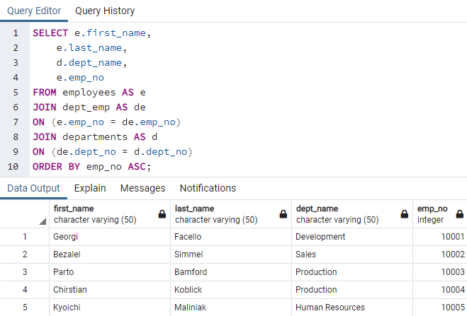
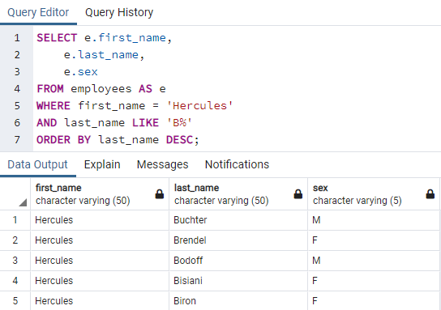
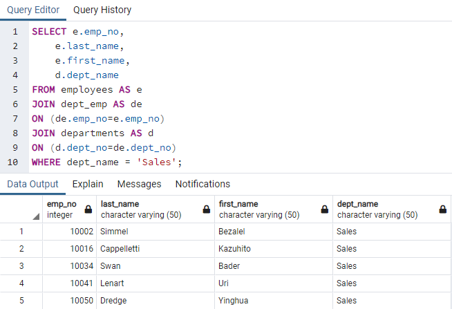
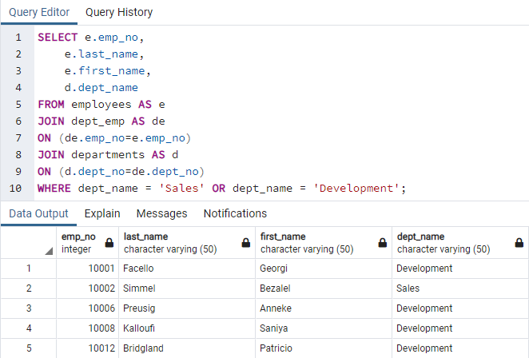
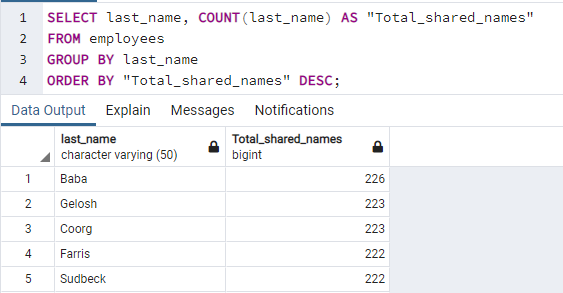
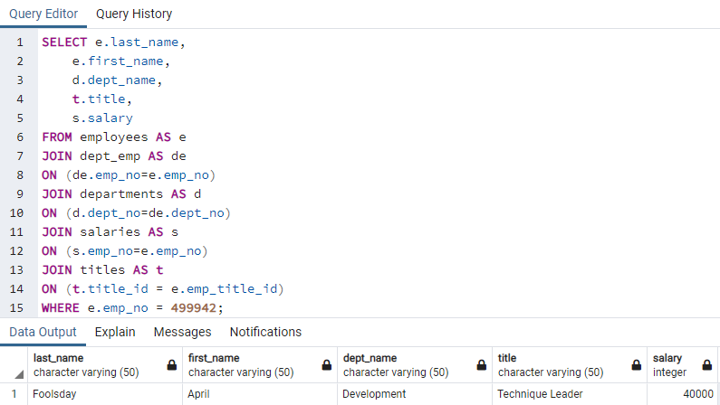

# SQL-EmployeeDB
HW9 SQL UofO Bootcamp Data Analytics

## Background

It has been two weeks since I've been hired as a new data engineer at Pewlett Hackard. My first major task was a research project on employees of the corporation from the 1980s and 1990s.

I have designed the tables to hold data in the CSVs, imported the CSVs into a SQL database, and answered questions about the data.

## 1. Data Engineering

## 2. Data analysis

1. List the following details of each employee: employee number, last name, first name, sex, and salary.

2. List first name, last name, and hire date for employees who were hired in 1986.

3. List the manager of each department with the following information: department number, department name, the manager's employee number, last name, first name.

4. List the department of each employee with the following information: employee number, last name, first name, and department name.

5. List first name, last name, and sex for employees whose first name is "Hercules" and last names begin with "B."

6. List all employees in the Sales department, including their employee number, last name, first name, and department name.

7. List all employees in the Sales and Development departments, including their employee number, last name, first name, and department name.

8. In descending order, list the frequency count of employee last names, i.e., how many employees share each last name.

## Bonus
This will be added at a later date, I suspect fake data!

## Epilogue
Evidence in hand, I marched into my boss's office and presented the visualization. With a sly grin, my boss thanked me for my work. On my way out of the office, I hear the words, "Search your ID number." My employee ID number is 499942....this is what I found!

Technique Leader should be paid more than this! Also when did I change my name? Lies! (All jokes)
